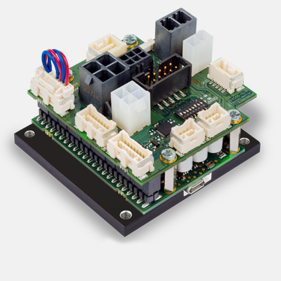

# epos
epos用ROS2パッケージ<br>



# 環境構築

## 要件
- Ubuntu22.04
- ROS2 Humble

## 依存関係
```bash
source /opt/ros/humble/setup.bash
rosdep update
cd ~/ws/src

git clone https://github.com/Nexis-R/epos
. epos/install-scripts/install-epos-command-library
cd ~/ws/src/
rosdep install -r -y -i --from-paths .
```

## ビルド
```bash
cd ~/ws
colcon build --symlink-install
source install/setup.bash
```

## 使用方法
### ターミナル1
```bash
ros2 launch epos epos4_usb_can_gateway.launch.xml
```

### ターミナル2(速度制御)
```bash
ros2 topic pub /epos/motor1/move_with_velocity std_msgs/msg/Float32 "data: 0.0"
or
ros2 topic pub /epos/motor1/move_with_velocity std_msgs/msg/Float32 "data: 1000.0"
```


## 参考
[Epos Command Library](https://www.maxongroup.com/medias/sys_master/8823917281310.pdf)
